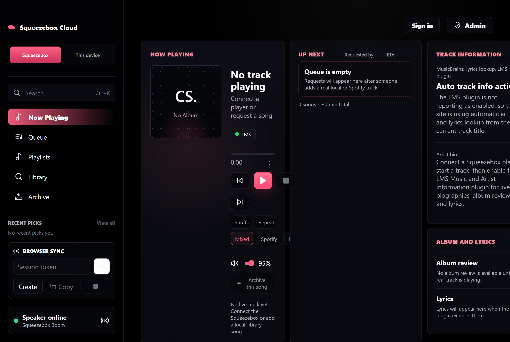

# Squeezebox Cloud

A deployed web **control plane** for a VPS-hosted Squeezebox / [Lyrion Music
Server](https://lyrion.org/) (LMS) setup. Guests get a clean public "now playing
+ request a song" page; the owner gets an admin surface for the queue, library,
playlists, and integrations — all driven by a live React UI over a WebSocket-synced
Express backend.

**▶ Live:** [harmonizerlabs.cc/cloud-squeeze](https://harmonizerlabs.cc/cloud-squeeze/)



## Why

LMS is powerful but its built-in web UI is dated and assumes a single trusted
operator on the LAN. Squeezebox Cloud puts a modern, phone-friendly front end on
top of it: friends can browse the library and queue requests from their own
devices, while the owner keeps moderation and playback control — served publicly
from a VPS, not just the local network.

## Features

- **Now playing & transport** — play/pause/next/prev/volume, proxied to LMS with a
  graceful in-memory fallback so the UI stays usable in local dev with no server.
- **Public request queue** — guests queue tracks; the owner approves/controls.
- **Library search** — scans the configured music source directory (`fast-glob`).
- **Playlists, curation & recommendations** — playlist management plus a
  recommender / listener-taste layer (`recommender.js`, `listenerTaste.js`,
  `curation.js`).
- **Spotify / Spotty status & search** — detects Spotify availability via LMS
  config, favorites, and plugin metadata.
- **Archive flows** and **browser-sync** (session-token pairing across devices).
- **Live sync** — WebSocket coordination keeps every connected client in step.

## Architecture

```text
React 19 + Vite (TypeScript) UI
   │  REST + WebSocket
   ▼
Express 5 API  (58 routes)
   ├─ lmsClient.js     → Lyrion/Squeezebox server (with in-memory fallback)
   ├─ library.js       → music-source scanning & search
   ├─ playlists.js / curation.js / recommender.js / listenerTaste.js
   ├─ archiveService.js
   └─ state.js         → shared state, WebSocket broadcast
```

Inputs are validated with **Zod**; the LMS client degrades to in-memory state so
the whole app runs locally without a real music server attached.

## Run locally

```bash
npm install
npm run dev            # Vite client + Express server (concurrently)
# open http://127.0.0.1:5177
```

## Tests

```bash
npm test               # Vitest unit/integration (12 test/spec files, supertest)
npm run test:ui        # Playwright UI tests
npm run smoke:library  # library scan smoke
npm run smoke:lms      # LMS integration smoke
npm run smoke:public   # public-surface smoke
npm run test:all       # vitest + build + smokes + Playwright
```

## Stack

React 19 · Vite 7 · TypeScript · Express 5 · `ws` (WebSocket) · Zod · Vitest ·
Playwright · Docker. Deployed behind nginx on a VPS at `/cloud-squeeze/`.

## Status

Actively deployed personal project. The public surface is live; admin actions and
integrations (LMS, Spotify/Spotty) require the corresponding services configured
on the host.

## License

MIT — see [LICENSE](LICENSE).
