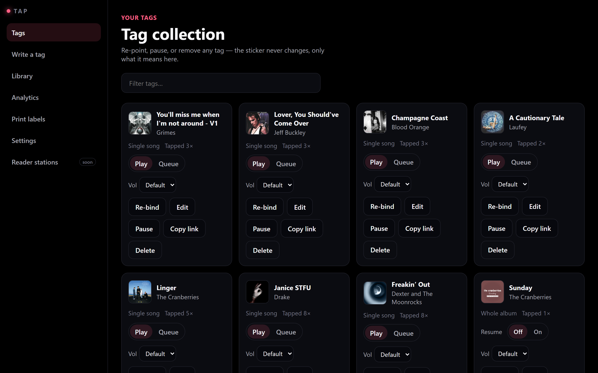
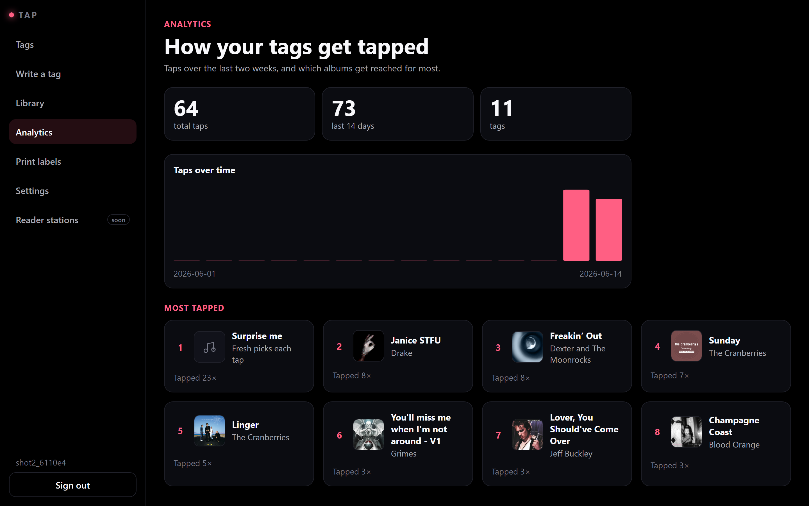

# Squeezebox Cloud — run a Squeezebox from any phone

**A live web control surface for a VPS-hosted Squeezebox / [Lyrion Music Server](https://lyrion.org/)
(LMS): guests browse the library and queue songs from their phones, the owner runs
the queue and playback — and any NFC sticker can be bound to an album so a single tap
plays it on the speaker.**

**▶ Live:** [harmonizerlabs.cc/cloud-squeeze](https://harmonizerlabs.cc/cloud-squeeze/)



*The **Tap console**: every sticker is a re-pointable link to a song — the sticker never changes, only what it means.*

| Per-sticker tap analytics | WebSocket-synced jukebox |
|---|---|
|  | The console counts every tap — totals, a 14-day trend, and which stickers get reached for most. The jukebox itself is play/pause/next, shuffle/repeat, a **Mixed / Spotify / Local** source toggle, and a public request queue, all WebSocket-synced across clients. |

## Tap to play

Bind any **NTAG NFC sticker** to an album or song; tapping it opens a tiny page that
plays it on the Squeezebox — no app install, no login for the tap itself. Stickers are
**re-pointable**: the printed URL never changes, only what it resolves to, so one
sticker can mean a different album next week. The console writes tags over Web NFC,
prints QR label sheets, and counts taps per sticker.

Security is layered: an HMAC token in the URL *fragment* (never logged) gates the basic
tag, and the hardened tier verifies **NTAG 424 DNA "SUN"** tags with RFC-4493 AES-CMAC
and a monotonic counter, so a captured tap can't be replayed.

## Why it's hard

LMS is powerful but its built-in UI is dated and assumes one trusted operator on the
LAN. Squeezebox Cloud puts a modern, multi-user front end on top and serves it
*publicly* from a VPS: a React UI over a WebSocket-synced Express backend. **It runs
end-to-end with no music server attached** — the LMS client falls back to in-memory
state, so you can clone it and it just works. Requests are per-account (a signed-in
listener's plays shape *their* shuffle), inputs are Zod-validated, and admin access is
gated by an external SSO — while the public jukebox and the tap path stay open.

## Run locally

```bash
npm install
npm run dev          # Vite client + Express server → http://127.0.0.1:5177
```

---

*Everything below is engineering detail.*

## Where to look in the code

| Area | Path |
|---|---|
| React UI (now-playing, queue, library) | `src/` |
| Tap console (bind / write / QR / analytics) | `src/tap/` |
| Tap resolver + HMAC / SUN verification | `server/tap*.js` (`tapSun.js` = AES-CMAC) |
| LMS client (+ in-memory fallback) | `server/lmsClient.js` |
| Recommender / listener taste | `server/recommender.js`, `server/listenerTaste.js` |
| Live state + WebSocket broadcast | `server/state.js`, `server/app.js` |

## Architecture

```text
React 19 + Vite (TypeScript)
   │  REST + WebSocket
   ▼
Express 5 API
   ├─ lmsClient.js   → Lyrion/Squeezebox server (in-memory fallback)
   ├─ tap*.js        → NFC tag resolve / HMAC + NTAG-424 SUN verify
   ├─ library.js     → music-source scan & search
   ├─ recommender.js / listenerTaste.js / curation.js
   └─ state.js       → shared state + WebSocket broadcast
```

## Tests

```bash
npm test             # Vitest unit/integration (supertest)
npm run test:all     # vitest + build + smokes + Playwright
```

## Stack

React 19 · Vite · TypeScript · Express 5 · `ws` · Zod · Vitest · Playwright · Docker.
Deployed behind nginx on a VPS at `/cloud-squeeze/`; admin auth via an external SSO.

## License

MIT — see [LICENSE](LICENSE).
